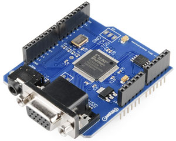
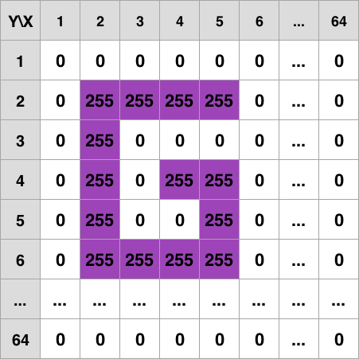
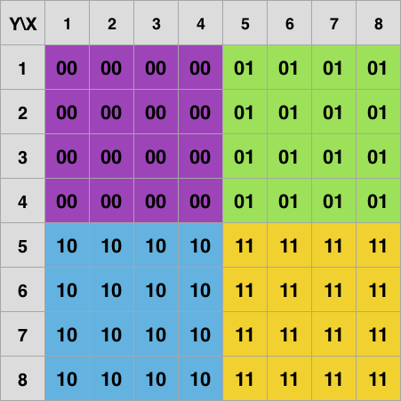
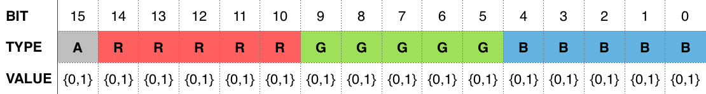

# Gameduino Unofficial Documentation
[_by--nc--sa-blue.svg?style=flat-square)]() []() []()

 

[Gameduino](http://excamera.com/sphinx/gameduino/) je shield, jenž poskytuje možnost připojit Arduino k VGA monitoru a audio výstupu a pracovat s grafickými prvky mnohem efektivněji. Základem grafického zobrazení jsou tři nezávislé [tile-based](https://en.wikipedia.org/wiki/Tile-based_video_game) vrstvy.

* [Vykreslování na obrazovku](#vykreslování-na-obrazovku)
	* [Background color](#background-color)
	* [Background](#background)
		* [RAM_PIC](#ram_pic)
		* [RAM_CHR](#ram_chr)
		* [RAM_PAL](#ram_pal)
* [Barva](#barva)
* [Kodér obrázků a (de)komprese](#kodér-obrázků-a-dekomprese)
	* [Background Encoder](#background-encoder)
* [Příklady](#příklady)
	* [Font 8x16px (background)](#font-8x16px-background)
* [Licence](#licence)

# Vykreslování na obrazovku
Gameduino poskytuje rozlišení `400 * 300px` přes VGA konektor.

Celý výstup tvoří tři nezávislé vrstvy. Platí pravidlo, že pokud barva pixelu v určité vrstvě je nastavena na průhlednou, tak je vidět vrstva, jenž se nachází pod ní.

- `background_color` - nejspodnější, tvořena jednou barvou
- `background` - pozadí
- `foreground` - vrstva `sprites`

## Background color
Nejspodnější vrstva. Tvoří ji jediná barva (16 bitů), jenž se zadává přímo do registru.

```c
GD.wr16(BG_COLOR, RGB(255,0,0));
```

## Background
Tato vrstva má rozměr `512 * 512px`, ale ve skutečnosti můžeme zobrazit pouze `400 * 300px`. Pokud není posunutá, pak pixely `x:401-512` a `y:301-512` se nachází mimo obrazovku. Posun vrstvy se zadává v pixelech v registru, každý s pomocí 16 bitů.

```c
GD.wr16(SCROLL_X, 0);
GD.wr16(SCROLL_Y, 0);
```

> character (znak) - základní jednotka pro vykreslování obrazovky, tvořena maticí pixelů 8x8

Celá vrstva `background` je vykreslována s pomocí 4096 znaků (64 řádků, 64 sloupců). Celkově může být definováno 256 různých znaků. V rámci jednoho znaku lze použít nejvýše 4 unikátní barvy.

Vrstvu můžeme v paměti rozdělit do tří skupin: `RAM_PIC`, `RAM_CHR`, `RAM_PAL`. `RAM_PIC` přímo udává, co ce bude vykreslovat, `RAM_CHR` a `RAM_PAL` slouží jako úložiště.

### RAM_PIC


- Přidělená paměť: 4096 bytes
- Rozsah paměti: 0x0000 - 0x0FFF
- Jedna hodnota zabírá: 1 byte
- Kapacita uložených hodnot: 4096

Do této vrstvy se umístí 4096 (64 * 64) pořadových čísel znaků (0-255, neboli 0x00-0xff), jenž se mohou libovolně opakovat. Hodnoty všech znaků jsou uloženy v `RAM_CHR`. Pokud uvedeme rozměry obrazovky ve znacích, tak bude zobrazeno 50 znaků na šířku a 37.5 znaků na výšku. 

***Příklad (viz tabulka)***
- základ `background` vrstvy tvoří znaky s pořadovým číslem nula, jenž jsou celé vyplněné bílou barvou
- s pomocí znaků s pořadovým číslem 255, jenž mají fialovou barvu, je vykresleno písmeno ***G***
- rozměry ***G*** jsou `32 * 40px`

V paměti by daná vrstva vypadala takto:

```c
static flash_uint8_t pictureOfChars[] = {
   0x00, 0x00, 0x00, 0x00, 0x00, 0x00, ... 0x00,
   0x00, 0xff, 0xff, 0xff, 0xff, 0x00, ... 0x00,
   0x00, 0xff, 0x00, 0x00, 0x00, 0x00, ... 0x00,
   0x00, 0xff, 0x00, 0xff, 0xff, 0x00, ... 0x00,
   0x00, 0xff, 0x00, 0x00, 0xff, 0x00, ... 0x00,
   0x00, 0xff, 0xff, 0xff, 0xff, 0x00, ... 0x00,
   ...
   0x00, 0x00, 0x00, 0x00, 0x00, 0x00, ... 0x00
}
```

### RAM_CHR
 

- Přidělená paměť: 4096 bytes
- Rozsah paměti: 0x1000 - 0x1FFF
- Jedna hodnota: 16 bytes (64 \* 2 bits)
- Kapacita uložených hodnot: 256

V této části paměti je definováno, jak mají vypadat jednotlivé znaky. Každý znak lze popsat s pomocí 16 bytů, tzn. maximální počet znaků je 256.

Znak je matice pixelů o rozměrech `8 * 8`, každý pixel je popsán s pomocí 2 bitů (2^2 kombinací = 4 různé barvy), jenž uchovávají pořadové číslo barvy daného znaku. 4 barvy pro každý znak jsou uloženy v `RAM_PAL`.

***Příklad (viz tabulka)***

Tento znak tvoří čtyři barvy (00 = fialová, 01 = zelená, 10 = modrá, 11 = žlutá), další barvu nelze přidat (neexistují jiné kombinace dvou bitů). Využijeme tento znak a definujeme ho jako první a druhý znak v paměti:

```c
static flash_uint8_t chars[] = {
   // 0. znak (nedefinovaný - hodnoty 0x00)
   0x00, 0x00, 0x00, 0x00, 0x00, 0x00, 0x00, 0x00, 0x00, 0x00, 0x00, 0x00, 0x00, 0x00, 0x00, 0x00,
   // 1. znak
   0x00, 0x55, 0x00, 0x55, 0x00, 0x55, 0x00, 0x55, 0xaa, 0xff, 0xaa, 0xff, 0xaa, 0xff, 0xaa, 0xff,
   // 2. znak
   0x00, 0x55, 0x00, 0x55, 0x00, 0x55, 0x00, 0x55, 0xaa, 0xff, 0xaa, 0xff, 0xaa, 0xff, 0xaa, 0xff,
   ...
}
```

### RAM_PAL
- Přidělená paměť: 2048 bytes
- Rozsah paměti: 0x2000 - 0x27FF
- Jedna hodnota: 8 bytes (4 \* 2 bytes)
- Kapacita uložených hodnot: 256

Zde se ukládají barvy pro každý ze 256 znaků. Jelikož každý znak může mít pouze 4 barvy, pro ukládání stačí 8 bytů. Každá barva je uložena v little endian (viz [barva](#barva)).

Využijeme znaku, jenž byl popsán v [RAM_CHR](#ram_chr), barvy definujeme jako:

| Barva   | Big Endian | Little Endian |
|:--------|:-----------|:--------------|
| fialová | 0x4d17     | 0x174d        |
| zelená  | 0x4f8b     | 0x8b4f        |
| modrá   | 0x32db     | 0xdb32        |
| žlutá   | 0x467b     | 0x467b        |

```c
static flash_uint8_t colors[] = {
   // Barvy 0. znaku (nedefinované - hodnoty 0x00 )
   0x00, 0x00, 0x00, 0x00, 0x00, 0x00, 0x00, 0x00,
   // Barvy 1. znaku
   0x8b, 0x4f, 0xdb, 0x32, 0x46, 0x7b, 0x17, 0x4d,
   // Barvy 2. znaku
   0x8b, 0x4f, 0xdb, 0x32, 0x46, 0x7b, 0x17, 0x4d,
   ...
}
```

# Barva
Každá definovaná barva zabírá 16 bitů paměti. Nejvyšší bit (typ A) určuje, zda tato barva je průhledná. Pokud ano, tak zbytek hodnot je ignorován, tzn. nelze vytvořit poloprůhlednou barvu.



Bity 0-14 jsou určeny pro ukládání odstínu. Většinou jsme zvyklí definovat každou z RGB barev hodnotou 8 bitů a mít `256 * 256 * 256 = 16 777 216` barevných odstínů. Zde je každá ze základních barev určena 5 bity. Při transformaci z normálního obrázkového formátu dochází k přemapování hodnoty z 0-255 na 0-31, což snižuje celkový počet barevných odstínů na `32 768`.

Pro ukládání barvy se používá little endian. Příklad uložení zelené barvy:

| Formát                       | Hodnota                |
|:-----------------------------|:-----------------------|
| RGB                          | (0, 255, 0)            |
| Binární gameduino            | 0b 0000 0011 1110 0000 |
| Hexadecimální gameduino      | 0x0BE0                 |
| Hexadecimální little endian  | 0xE00B                 |


# Kodér obrázků a (de)komprese
Téměř určitě vznikne potřeba použít vlastní grafiku pro zobrazení na monitoru. Převod do hexadecimální podoby zajistí [Gameduino Encoder](http://gameduino.com/tools/).

## Background Encoder
Při standardním spuštění je vytvořen soubor `image.h`, jenž zabírá víc místa, ale popisuje všechny hodnoty v přesně zadaném pořadí. Takový soubor se do paměti gameduina ukládá jako:

```c
// Nahrát pořadová čísla znaků do paměti, počátek v RAM_PIC (0x0000)
for (byte y = 0; y < 1; y++)
   GD.copy(RAM_PIC + y * 64, image_pic + y * 1, 1);
// Nahrát znaky do paměti, počátek v RAM_CHR (0x1000)
GD.copy(RAM_CHR, image_chr, sizeof(image_chr));
// Nahrát barvy znaků do paměti, počátek v RAM_PAL (0x2000)
GD.copy(RAM_PAL, image_pal, sizeof(image_pal));
```

Pokud je potřeba šetřit pamětí arduina, tak existuje možnost komprese obrázku (`compress`). Pak se do paměti gameduina musí nahrávat s dekompresí:

```c
for (byte y = 0; y < 1; y++)
   GD.copy(RAM_PIC + y * 64, image_pic + y * 1, 1);
GD.uncompress(RAM_CHR, image_chr);
GD.uncompress(RAM_PAL, image_pal);
```

Pokud je počátek každé z pamětí již vyplněn daty, tak je potřeba posunout ukazatelé na vhodné místo.

# Příklady
## Font 8x16px (background)
- [Demo](http://excamera.com/sphinx/gameduino/demos/cp437/)

Obrázek prvních 128 znaků cp437 pro [background](#background) vrstvu, bílá písmena na černém pozadí. 


```c
#include <SPI.h>     // SPI interface
#include <GD.h>      // Gameduino
#include "cp437.h"   // Hexadec hodnoty 128 symbolů, jejich palety

static int atxy(int x, int y) {
   // Zjistit pořadové číslo pointeru z background vrstvy (z 4096 znaků)
   // y zjištuje řádek, jelikož font je 16px na výšku, tak musí přeskočit 1 řádek znaků 8*8px
   //    "Hello":
   //       (0 << 7) + 0 = 0
   //    "This is the cp437"
   //       (1 << 7) + 2 = (64 + 64) + 2 = 130
   //       Přeskočíme 1. a 2. řádek 64 znaků (může být zabraný jiným textem), jsme na 3. řádku znaků, 3. znak zleva
   //
   // x určuje x-sovou souradnici v každém řádku
   return (y << 7) + x;
}

static void drawstr(uint16_t addr, const char *s) {
   while (*s) {                                       // Pro každý symbol
      uint16_t w = pgm_read_word(cp437_pic + 2 * *s); // Je určen 16 bity (horní a dolní část 8*8px každého symbolu)
      GD.wr(addr, lowByte(w));                        // Horní část 8*8px na určený uživatelem řádek znaků
      GD.wr(addr + 64, highByte(w));                  // Dolní část 8*8px na další řádek znaků
      s++, addr++;                                    // Vzít další symbol a další pozoci horního znaku
   }
}

void setup() {
   GD.begin();                                   // Inicializace gameduina
   GD.uncompress(RAM_CHR, cp437_chr);            // Dekomprese znaků a uložení od prvního pointeru v RAM_CHR
   GD.uncompress(RAM_PAL, cp437_pal);            // Dekomprese palety a uložení od prvního pointeru v RAM_PAL
   drawstr(atxy(0, 0), "Hello");                 // Od pozice symbolu 8*16px [0:0] vypiš text 
   drawstr(atxy(10, 2), "This is the cp437");    // Od pozice symbolu 8*16px [10:2] vypiš text
   for (byte i = 0; i < 14; i++)
      drawstr(atxy(i, 4 + i), " *Gameduino* ");  // Od pozice symbolů 8*16px [0,4], [1,5] ... vypiš text
}

void loop(){}
```

# Licence
Toto dílo podléhá licenci [Creative Commons Attribution-NonCommercial-ShareAlike 4.0 International License](http://creativecommons.org/licenses/by-nc-sa/4.0/).

[](http://creativecommons.org/licenses/by-nc-sa/4.0/)