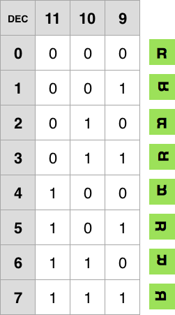

# Gameduino Documentation (neoficiální)
[_by--nc--sa-blue.svg?style=flat-square)]() []() []()

 

[Gameduino](http://excamera.com/sphinx/gameduino/) - shield, poskytuje možnost připojit Arduino k VGA monitoru a audio výstupu. Základem grafického zobrazení jsou tři nezávislé [tile-based](https://en.wikipedia.org/wiki/Tile-based_video_game) vrstvy.

* [Některé základní metody knihovny Gameduino](#některé-základní-metody-knihovny-gameduino)
* [Vykreslování na obrazovku](#vykreslování-na-obrazovku)
	* [Background color](#background-color)
	* [Background](#background)
		* [RAM_PIC](#ram_pic)
		* [RAM_CHR](#ram_chr)
		* [RAM_PAL](#ram_pal)
	* [Foreground](#foreground)
		* [RAM_SPR](#ram_spr)
		* [RAM_SPRIMG](#ram_sprimg)
			* [Jeden sprite 256 barev](#jeden-sprite-256-barev)
			* [Jeden sprite 16 barev](#jeden-sprite-16-barev)
			* [Jeden sprite 4 barev](#jeden-sprite-4-barev)
		* [PALETY](#palety)
			* [Přiřazení palety spritu (PALETTE)](#přiřazení-palety-spritu-palette)
		* [Rotace spritu](#rotace-spritu)
		* [Kolize spritu](#kolize-spritu)
* [Barva](#barva)
* [Kodér obrázků a (de)komprese](#kodér-obrázků-a-dekomprese)
	* [Background Encoder](#background-encoder)
	* [Foreground Encoder](#foreground-encoder)
* [Příklady](#příklady)
	* [Font 8x16px (background)](#font-8x16px-background)
* [Licence](#licence)


# Některé základní metody knihovny Gameduino
- *bool* **GD::begin ()** - inicializace gameduina, reset veškeré paměti na hodnoty 0x00

- *byte* **GD::rd (unsigned int addr)** - přečte 8bit z paměti (přes ukazatel)
- *unsigned* **int GD::rd16(unsigned int addr)** - přečte 16bit z paměti (přes ukazatel)
- *void* **GD::wr (unsigned int addr, byte v)** - zapíše 8bit s hodnotou `v` do paměti (přes ukazatel)
- *void* **GD::wr16 (unsigned int addr, unsigned int v)** - zapíše 16bit s hodnotou `v` do paměti (přes ukazatel)

- *void* **GD::fill (int addr, byte v, unsigned int count)**	- vyplní pamět hodnotami `v` od ukazatele, `count` určuje počet zapisovaných hodnot

- *void* **GD::copy (unsigned int addr, prog_uchar src, int count)** - kopírování dat z AVR flash paměti do paměti gameduina (např pro grafické prvky)
- *void* **GD::uncompress (unsigned int addr, prog_uchar src)** - kopírování dat z AVR flash paměti do paměti gameduina s využitím dekomprese (např pro grafické prvky)

- *void* **GD::sprite (int spr, int x, int y, byte image, byte palette, byte rot=0, byte jk=0)** - zadává vlastnosti a vykresluje jeden ze [spritů](#foreground)

- *void* **GD::waitvblank()** - funkce čeká na vykreslení celé obrazovky, využití pro plynulé animace a validní kolize objektů

Jiné metody: [http://excamera.com/sphinx/gameduino/GD/index.html](http://excamera.com/sphinx/gameduino/GD/index.html)


# Vykreslování na obrazovku
Gameduino poskytuje rozlišení `400 * 300px` přes VGA konektor. Celý výstup tvoří tři nezávislé vrstvy. Platí pravidlo, že pokud barva pixelu v určité vrstvě je nastavena na průhlednou, tak je vidět vrstva, jenž se nachází pod ní.

- [`background_color`](#background_color) - nejspodnější, tvořena jednou barvou, statická
- [`background`](#background) - různobarevné pozadí, posouvat lze pouze jako celek
- [`foreground`](#foreground) - vrstva [spritů](https://en.wikipedia.org/wiki/Sprite_(computer_graphics)), posouvat lze jednotlivé sprity `16 * 16px`


## Background color
Nejspodnější vrstva. Tvoří ji jediná barva (16 bitů), jenž se zadává přímo do registru.

```c
GD.wr16(BG_COLOR, RGB(255,0,0));
```


## Background
Vrstva o rozměru `512 * 512px`, ale ve skutečnosti můžeme vidět pouze `400 * 300px`. Pokud není posunutá, pak pixely `x:401-512` a `y:301-512` se nachází mimo obrazovku. Posun vrstvy se zadává v pixelech v registru, každý s pomocí 16 bitů (0-511).

```c
GD.wr16(SCROLL_X, 0);
GD.wr16(SCROLL_Y, 0);
```

> **Poznámka:** character (znak) - základní jednotka pro vykreslování obrazovky, tvořen maticí pixelů 8x8

Celá vrstva `background` je vykreslována s pomocí 4096 znaků (64 řádků, 64 sloupců). Celkově může být definováno 256 různých znaků (v [`RAM_CHR`](#ram_chr)). V rámci jednoho znaku lze použít nejvýše 4 unikátní barvy.

Vrstvu můžeme v paměti rozdělit do tří skupin: `RAM_PIC`, `RAM_CHR`, `RAM_PAL`. `RAM_PIC` přímo udává, co se bude vykreslovat, `RAM_CHR` a `RAM_PAL` slouží jako úložiště.


### RAM_PIC

- Přidělená paměť: 4096 bytes
- Jedna hodnota zabírá: 1 byte
- Kapacita uložených hodnot: 4096

Do této vrstvy se umístí 4096 (64 * 64) pořadových čísel znaků (`0-255`, neboli `0x00-0xff`), jenž se mohou libovolně opakovat. Hodnoty všech znaků jsou uloženy v [`RAM_CHR`](#ram_chr). Viditelná část vrstvy má 50 znaků na šířku a 37.5 znaků na výšku. 

> **Příklad (viz tabulka):**
> - základ `background` vrstvy tvoří znaky s pořadovým číslem nula, jenž jsou celé vyplněné bílou barvou
> - s pomocí znaků s pořadovým číslem 255, jenž mají fialovou barvu, je vykresleno písmeno ***G***
> - rozměry ***G*** jsou `32 * 40px`

V paměti by daná vrstva vypadala takto:

```c
static flash_uint8_t pictureOfChars[] = {
   0x00, 0x00, 0x00, 0x00, 0x00, 0x00, ... 0x00,
   0x00, 0xff, 0xff, 0xff, 0xff, 0x00, ... 0x00,
   0x00, 0xff, 0x00, 0x00, 0x00, 0x00, ... 0x00,
   0x00, 0xff, 0x00, 0xff, 0xff, 0x00, ... 0x00,
   0x00, 0xff, 0x00, 0x00, 0xff, 0x00, ... 0x00,
   0x00, 0xff, 0xff, 0xff, 0xff, 0x00, ... 0x00,
   ...
   0x00, 0x00, 0x00, 0x00, 0x00, 0x00, ... 0x00
}
```


### RAM_CHR

- Přidělená paměť: 4096 bytes
- Jedna hodnota zabírá: 16 bytes (64 \* 2 bits)
- Kapacita hodnot: 256

V této části paměti je definováno, jak mají vypadat jednotlivé znaky. 

Znak je matice pixelů o rozměrech `8 * 8`, každý pixel je popsán s pomocí 2 bitů (2^2 kombinací = 4 různé barvy), jenž uchovávají pořadové číslo barvy daného znaku (princip masky). 4 barvy pro každý znak jsou uloženy v [`RAM_PAL`](#ram_pal).

> **Příklad (viz tabulka):** Tento znak tvoří čtyři barvy (00 = fialová, 01 = zelená, 10 = modrá, 11 = žlutá), další barvu nelze přidat (neexistují jiné kombinace dvou bitů). Využijeme tento znak a definujeme ho jako první a druhý znak v paměti:

```c
// Definujeme znaky v AVR flash pameti (zbytek pameti je vyplnen 0x00, viz GB.begin())
static flash_uint8_t chars[] = {
   // 0. znak
   0x00, 0x00, 0x00, 0x00, 0x00, 0x00, 0x00, 0x00, 0x00, 0x00, 0x00, 0x00, 0x00, 0x00, 0x00, 0x00,
   // 1. znak
   0x00, 0x55, 0x00, 0x55, 0x00, 0x55, 0x00, 0x55, 0xaa, 0xff, 0xaa, 0xff, 0xaa, 0xff, 0xaa, 0xff,
   // 2. znak
   0x00, 0x55, 0x00, 0x55, 0x00, 0x55, 0x00, 0x55, 0xaa, 0xff, 0xaa, 0xff, 0xaa, 0xff, 0xaa, 0xff,
}

// Zkopirujeme z AVR flash pameti do pameti gameduina
GD.copy(RAM_CHR, chars, sizeof(chars));
```


 

### RAM_PAL
- Přidělená paměť: 2048 bytes
- Jedna hodnota zabírá: 8 bytes (4 \* 2 bytes)
- Kapacita hodnot: 256

Pamět pro uložení 4 barev (8 bytů) pro každý ze 256 znaků. Každá barva je uložena v little endian (viz [barva](#barva)).

> **Příklad:** Využijeme znaku, jenž byl popsán v [RAM_CHR](#ram_chr), barvy definujeme jako:

| Barva   | Big Endian | Little Endian |
|:--------|:-----------|:--------------|
| fialová | 0x4d17     | 0x174d        |
| zelená  | 0x4f8b     | 0x8b4f        |
| modrá   | 0x32db     | 0xdb32        |
| žlutá   | 0x467b     | 0x467b        |

```c
// Definujeme barvy v AVR flash pameti
static flash_uint8_t colors[] = {
   // Barvy 0. znaku (nedefinovane - hodnoty 0x00 )
   0x00, 0x00, 0x00, 0x00, 0x00, 0x00, 0x00, 0x00,
   // Barvy 1. znaku
   0x8b, 0x4f, 0xdb, 0x32, 0x46, 0x7b, 0x17, 0x4d,
   // Barvy 2. znaku
   0x8b, 0x4f, 0xdb, 0x32, 0x46, 0x7b, 0x17, 0x4d,
   ...
}

// Zkopirujeme z AVR flash pameti do pameti gameduina
GD.copy(RAM_PAL, colors, sizeof(colors));
```


## Foreground
Vrstva je určena pro zobrazovaní spritů na monitoru, každý sprite má rozměry `16 * 16px` (větší sprity lze skládat ze základních). Každému z možných 256 spritů na obrazovce je v [`RAM_SPR`](#ram_spr) přiřazena právě jedna paleta a právě jedna z masek, podle které se budou zobrazovat barvy z vybrané palety.

Gameduino může v sobě uchovávat 64 256-barevných masek spritů, nebo 128 16-barevných masek spritů, nebo 256 4-barevných masek spritů. Nebo jejich libovolné kombinace. 

> **Příklad:** Do paměti uložíme 63 256-barevných, jednu 16-barevnou a dvě 4-barevné masky. Celkový počet různých masek je 66.
> 
> **Příklad:** Definujeme jeden ze 64 256-barevných spritů, můžeme ho vykreslit na obrazovku až 256krát.

Může být definováno 8 unikátních palet. Čtyři palety obsahující 256 barev v `RAM_SPRPAL`, dvě obsahující 16 barev v `PALETTE16A` a `PALETTE16B` a dvě obsahující 4 barvy v `PALETTE4A` a `PALETTE4B`.

> **Poznámka:** Maximální počet různých spritů můžeme zvětšit takovým způsobem, že definujeme např. 64 různých 256-barevných postaviček (masek) s tím, že každá bude mít 4 vlastní různobarevné kopie (palety). První postavička bude nejdřív využívat první 256-barevné palety a bude zelená. Pak bude využívat druhé palety a bude fialová. Celkový počet kombinací 256-barevných postaviček bude 64*4=256.


### RAM_SPR
- Přidělená paměť: 2048 bytes
- Jedna hodnota zabírá: 4 bytes
- Kapacita hodnot: 512 (uživatel definuje pouze 256 hodnot, zbytek je využívan gameduinem pro lepší vykreslování)

Uchovává vlastnosti používaných spritů, každý je určen přesně 32 bity. Maximální počet spritů na obrazovce je 256. Zápis se provádí s pomocí metody [GD.sprite(...)](#některé-základní-metody-knihovny-gameduino). Číslo spritu (int spr) zárověn určuje z-index překrytí - větší pořadové číslo překrývá sprity s menšími čísly.


- **C** - určuje typ spritu pro počítání [kolizí](#kolize-spritu) (0-1)
- **IMAGE** - pořadové číslo masky z [RAM_SPRIMG](#ram_sprimg) (0-64)
- **PALETTE** - určuje jednu z 8 [palet](#paltey) (0-15)
- **ROTATION** - určuje typ [rotace spritu](#rotace-spritu) (0-7)
- **X** - 0-511 - souřadnice spritu podle osy x (0-511)
- **Y** - 0-511 - souřadnice spritu podle osy y (0-511)


 

### RAM_SPRIMG
- Přidělená paměť: 16384 bytes
- Jedna hodnota zabírá: 256 bytes
- Kapacita hodnot: 64

Tato pamět obsahuje masky pořadových čísel barev 64 spritů, podle které se budou vybarvovat jednotlivé pixely v závislosti na barevné paletě vybrané v `RAM_SPR`.


> **Příklad (viz tabulka):** Maska 256-barevného spritu. První sloupec a první řádek pixelů jsou vyplněny barvou s pořadovým číslem 1. Z barvy číslo 255 je napsaný symbol **S**, zbytek je vyplněn barvou číslo 0. 
> Pokud na danou masku aplikujeme první 256-barevnou paletu, kde 0. barva bude bílá, 1. modrá a 255. šedá, tak dostaneme podobný vzhled, jako v tabulce. Pokud však aplikujeme na masku paletu, kde 255. barva je definována jako průhledná, tak získáme "děravý" sprite, přes který bude vidět `background` vrstva.

#### Jeden sprite 256 barev
Máme `16 * 16 = 256` hodnot typu `0b 0000 0000`. Každá hodnota se čte jako celek a určuje pořadové číslo barvy (0-255).

#### Jeden sprite 16 barev
Pokud chceme vytvořit 16-barevný sprite, tak si teoreticky rozdělíme jeden 256-barevný sprite na dva. Pak máme `16 * 16 = 256` hodnot typu `0b 0000 0000`, kde první čtveřice bitů určuje pořadové číslo barvy (0-15) prvního spritu a druhá čtveřice (0-15) druhého. To, jaká čtveřice se bude číst (o jaký ze dvou spritů se bude jednat), je určeno v `RAM_SPR` 4 bitama typu PALETTE (viz [PALETY](#palety)).

#### Jeden sprite 4 barev
Pro vytvoření spritu ze 4 barev uplatníme stejný postup, jako pro 16-barevný. Ted dělíme jeden 16-barevný na dva 4-barevné. Máme `16 * 16 = 256` hodnot typu `0b 00 00 00 00`. První dva bity určují pořadového číslo barvy prvního spritu atd. 


### PALETY
Uživatel může definovat 8 unikátních palet pro vykreslování spritů.

| Ukazatel | Paměť | Jedna hodnota | Kapacita hodnot |
|:--|:--|:--|:--|
| **RAM_SPRPAL** | 4 * 512 bytes | 2 bytes | 4 * 256 |  
| **PALETTE16A** | 32 bytes | 2 bytes | 16 |  
| **PALETTE16B** | 32 bytes | 2 bytes | 16 |  
| **PALETTE4A** | 8 bytes | 2 bytes | 4 |  
| **PALETTE4B** | 8 bytes | 2 bytes | 4 |  

Palety obsahující 256 barev nemají každá svůj ukazatel, jsou definovány jen ukazatelem na první 256 barevnou paletu. Ukazatel na druhou je (`RAM_SPRPAL + 256`). Palety `PALETTE16A`, `PALETTE16B`, `PALETTE4A` a `PALETTE4B` se v rámci paměti nachází v registru.

Definovat barvy v paletách lze např. tímto způsobem:

```c
// Definovat 4 palety po 256 barvach (vsechny barvy v palete jsou bile)
// (i << 1) jsou suda cisla, protoze zapisujeme po 2 bytech
for (i = 0; i < (4 * 256); i++)
   GD.wr16(RAM_SPRPAL + (i << 1), RGB(255,255,255));  

// Definovat 16 barev v paletach
for (i = 0; i < 16; i++) {
   GD.wr16(PALETTE16A + (i << 1), RGB(255,255,255));
   GD.wr16(PALETTE16B + (i << 1), RGB(255,255,255));
}

// Definovat 4 barvy v paletach
for (i = 0; i < 4; i++) {
   GD.wr16(PALETTE4A + (i << 1), RGB(255,255,255));
   GD.wr16(PALETTE4B + (i << 1), RGB(255,255,255));
}
```

> **Příklad:** [http://excamera.com/sphinx/gameduino/samples/palettes/](http://excamera.com/sphinx/gameduino/samples/palettes/)


#### Přiřazení palety spritu (PALETTE)

- `PP` - číslo 256-barevné palety {00, 01, 10, 11}
- `A/B` - určuje jaký ze dvou typů palet (A nebo B) se bude používat (A = 0, B = 1)
- `N` - jaká čtveřice bitů se bude číst (nižší = 0, vyšší = 1)
- `NN` - jaká dvojice bitů se bude číst (nejnižší = 00, nejvyšší = 11)

| BIT | 3 | 2 | 1 | 0 |
|:--|:--:|:--:|:--:|:--:|
| **256 barev** | 0 | 0 | P | P | 
| **16 barev** | 0 | 1 | N | A/B |
| **4 barvy** | 0 | N | N | A/B |




### Rotace spritu

Rotaci spritu zajištují 3 bity v paměti [`RAM_SPR`](#ram_spr). Podle osy `x` překlápí 11. bit, podle `y` 10. bit, 9. bit překlápí sprite diagonálně. Všechny možné typy rotací a jejich decimální hodnota jsou uvedeny v tabulce.


### Kolize spritu
Všechny sprity se dělí na dva typy `J` (31.bit = 0) a `K` (31.bit = 1). Ke kolizi může dojít vždy pouze mezi dvěma spritama různých typů.


# Barva
Každá definovaná barva zabírá 16 bitů paměti. Nejvyšší bit (typ A) určuje, zda tato barva je průhledná. Pokud ano, tak zbytek hodnot je ignorován, tzn. nelze vytvořit poloprůhlednou barvu.


Bity 0-14 jsou určeny pro ukládání odstínu. Většinou jsme zvyklí definovat každou z RGB barev hodnotou 8 bitů a mít `256 * 256 * 256 = 16 777 216` barevných odstínů. Zde je každá ze základních barev určena 5 bity. Při transformaci z normálního obrázkového formátu dochází k přemapování hodnoty z 0-255 na 0-31, což snižuje celkový počet barevných odstínů na `32 768`.

Pro ukládání barvy se používá little endian. Příklad uložení zelené barvy:

| Formát                       | Hodnota                |
|:-----------------------------|:-----------------------|
| RGB                          | (0, 255, 0)            |
| Binární gameduino            | 0b 0000 0011 1110 0000 |
| Hexadecimální gameduino      | 0x0BE0                 |
| Hexadecimální little endian  | 0xE00B                 |


# Kodér obrázků a (de)komprese
Téměř určitě vznikne potřeba použít vlastní grafiku pro zobrazení na monitoru. Převod do hexadecimální podoby zajistí [Gameduino Encoder](http://gameduino.com/tools/).

## Background Encoder
Při standardním spuštění je vytvořen soubor `image.h`, jenž zabírá víc místa, ale popisuje všechny hodnoty v přesně zadaném pořadí. Takový soubor se do paměti gameduina ukládá jako:

```c
// Nahrat poradova cisla znaku do pameti, pocatek v RAM_PIC (0x0000)
for (byte y = 0; y < 1; y++)
   GD.copy(RAM_PIC + y * 64, image_pic + y * 1, 1);
// Nahrat znaky do pameti, pocatek v RAM_CHR (0x1000)
GD.copy(RAM_CHR, image_chr, sizeof(image_chr));
// Nahrat barvy znaku do pameti, pocatek v RAM_PAL (0x2000)
GD.copy(RAM_PAL, image_pal, sizeof(image_pal));
```

Pokud je potřeba šetřit pamětí arduina, tak existuje možnost komprese obrázku (`compress`). Pak se do paměti gameduina musí nahrávat s dekompresí:

```c
for (byte y = 0; y < 1; y++)
   GD.copy(RAM_PIC + y * 64, image_pic + y * 1, 1);
GD.uncompress(RAM_CHR, image_chr);
GD.uncompress(RAM_PAL, image_pal);
```

Pokud je počátek každé z pamětí již vyplněn daty, tak je potřeba posunout ukazatelé na vhodné místo.


## Foreground Encoder
Oficiální stránky nefungují (500 Internal Server Error). Existuje možnost samostatně stáhnout python package a kodovat obrázky na vlastním počítači.


# Gameduino: Python package
[Python Gameduino](http://excamera.com/sphinx/gameduino/python.html)

Existuje oficiální package gameduino v rámci python `2.7`, jenž poskytuje některé funkce pro práci s shieldem. Je však zastaralý a po instalaci potřebuje manuálně upravit zdrojový kod.

Mezi užitečné funkce patří např. kodér background, kodér spritů, screenshot obrazovky (bez využití fyzického shieldu).


## Install
> **Poznámka:** Následující instrukce byly testovány pouze na macOS Sierra 10.12.4

```bash
# python 2.7 required
easy_install pip       # Install pip
pip install pillow     # Install lib for images
pip install gameduino  # Install gameduino
```

Ujistěte se, že Váš `$PYTHONPATH` je v pořádku. 

```bash
# Launch python & check import Image
python
>>> from PIL import Image
```

Při spuštění ukázkových skriptů z `./python/` se budou generovat jednotlivé chyby. Především se to týká `import Image`, jenž se má v souborech gameduino nahradit za `from PIL import Image`, a různých názvů deprecated funkcí/metod, jenž se mají nahradit podle chybové zprávy (pouze název).

## Skripty ./python/
- ***encoder_background.py*** - transformace obrázku pro využití na backgroud vrstvě, vytváří preview obrazovky se všema znakama


# Příklady
## Font 8x16px (background)
- [Demo](http://excamera.com/sphinx/gameduino/demos/cp437/)

Gameduino má standardní ascii font definovaný na background vrstvě jako znaky `8 * 8px`. Pokud chceme využívat lépe vypadající font `8 * 16px`, musíme nahrát do paměti již připravený obrázek prvních 128 znaků cp437 pro [background](#background) vrstvu (bílá písmena na černém pozadí).

```c
#include <SPI.h>     // SPI interface
#include <GD.h>      // Gameduino
#include "cp437.h"   // Hexadec hodnoty 128 symbolu, jejich palety

static int atxy(int x, int y) {
   // Zjistit poradove cislo pointeru z background vrstvy (z 4096 znaku)
   // Y urcuje y-sovou souradnici radku, jelikoz font je 16px na vysku, tak musi preskocit 1 radek znaku 8 * 8px
   //    "Hello":
   //       (0 << 7) + 0 = 0
   //    "This is the cp437"
   //       (1 << 7) + 2 = (64 + 64) + 2 = 130
   //       Preskocime 1. a 2. radek 64 znaku (muze byt zabrany jinym textem), jsme na 3. radku znaku, 3. znak zleva
   //
   // X urcuje x-sovou souradnici v kazdem radku
   return (y << 7) + x;
}

static void drawstr(uint16_t addr, const char *s) {
   while (*s) {                                       // Pro kazdy symbol
      uint16_t w = pgm_read_word(cp437_pic + 2 * *s); // Je urcen 16 bity (horni a dolni cast 8 * 8px kazdeho symbolu)
      GD.wr(addr, lowByte(w));                        // Horni cast 8 * 8px na urceny uzivatelem radek znaku
      GD.wr(addr + 64, highByte(w));                  // Dolni cast 8 * 8px na dalsi radek znaku
      s++, addr++;                                    // Bere dalsi symbol a dalsi pozici horniho znaku
   }
}

void setup() {
   GD.begin();                                   // Inicializace gameduina
   GD.uncompress(RAM_CHR, cp437_chr);            // Dekomprese znaku a ulozeni od prvniho pointeru v RAM_CHR
   GD.uncompress(RAM_PAL, cp437_pal);            // Dekomprese palety a ulozeni od prvniho pointeru v RAM_PAL
   drawstr(atxy(0, 0), "Hello");                 // Od pozice symbolu 8 * 16px [0:0] vypis text 
   drawstr(atxy(10, 2), "This is the cp437");    // Od pozice symbolu 8 * 16px [10:2] vypis text
   for (byte i = 0; i < 14; i++)
      drawstr(atxy(i, 4 + i), " *Gameduino* ");  // Od pozice symbolu 8 * 16px [0,4], [1,5] ... vypis text
}

void loop(){}
```

# Licence
Toto dílo podléhá licenci [Creative Commons Attribution-NonCommercial-ShareAlike 4.0 International License](http://creativecommons.org/licenses/by-nc-sa/4.0/).

[](http://creativecommons.org/licenses/by-nc-sa/4.0/)
